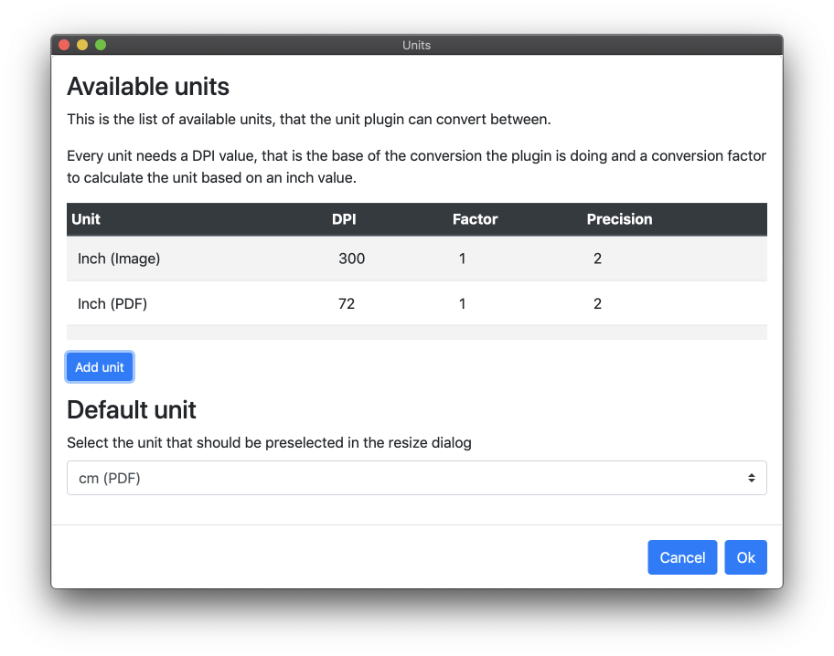
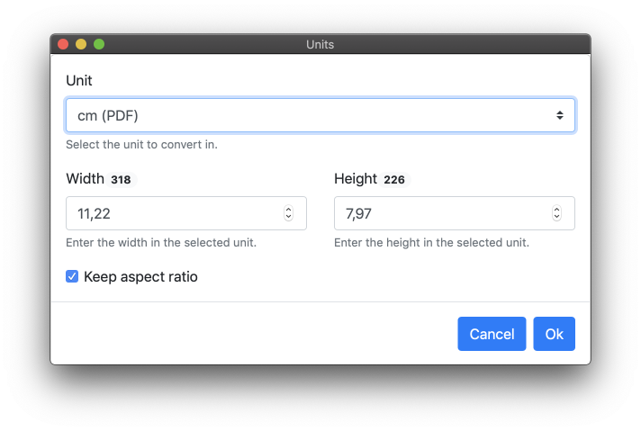

# Units

Units is a [Sketch](https://https://sketchapp.com/) plugin for working with print units (inch, cm, mm) in Sketch's pixel world.

## Features

* Calculates the print unit value from the pixel value for width and heights and back
* Resizes one or more layers based on pixel unit values

## Manual Installation

* Download the plugin zip file from the [releases page](https://github.com/dploeger/sketch-plugin-units/releases) and extract the archive
* Double click on the units.sketchplugin file

## Usage

### Settings

Use the settings dialog to manage the available units. For each unit, you need to define a name, a DPI value, a factor to convert from inch to your desired unit and a precision number.

Also, select a default unit, that will be used when resizing a layer or showing its size.

These units come with the plugin itself:

  * Inch (Image): Inches, when the layer will be exported to an image
  * Inch (PDF): Inches, when the layer will be exported to a PDF
  * cm (Image): Centimeters, when the layer will be exported to an image
  * cm (PDF): Centimeters, when the layer will be exported to a PDF

### Resize a layer

Select a layer and run the "Resize" command from the plugin menu.

Here you can enter the desired size in the selected unit. Hit Ok to resize the layer accordingly.

### Show size

To quickly show the size of a layer in your selected default unit, select the "Show Size" command from the plugin menu or hit `Ctrl Shift S`.

## DPI values

The DPI value (Dots Per Inch) is the main factor for converting pixels to print units and back.

If you plan to export your design as a vector file (e.g. PDF) you should set it to 72, because that's Sketch's default value.

On the other hand, if you plan to export to an image file, you can basically set this value to what you like, but for print it's usually 300.
